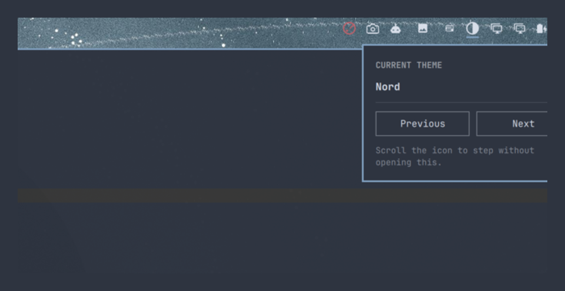

# Next Theme

Omarchy ships a long list of themes. Their names — Miasma, Vantablack, Waffle Cat, Osaka Jade — tell you almost nothing about what they look like, and a theme is not a row in a list: it is your terminal, your editor, your borders, your bar and your wallpaper, all changing at once. The only honest way to judge one is to wear it for a minute. Next Theme makes that cost one click. Step forward through the themes, watch your whole desktop change under you, and stop when it looks right.



Every step is the real thing — a full `omarchy theme set`, applied everywhere — not a swatch or a preview. The popup stays open while you browse and re-colours itself as each theme lands, so the window you are choosing from is itself a sample of the theme you are choosing.

## How it works

- **Left click** — open the popup, then use **Previous** and **Next** to step through `omarchy theme list`, wrapping at the ends.
- **Scroll the icon** — step forward or back without opening anything.
- **Hover** — the tooltip names the theme you are on.

Right and middle clicks do nothing. There are no settings, no schedule and nothing to configure: it never changes a theme on its own, only when you ask it to. If you want rotation on a timer or on sunrise and sunset, that is a different plugin's job.

## The icon

The classic contrast circle: an outlined ring with its right half filled. Every applied theme rotates it a half turn clockwise, so the light and dark halves trade places. If the change fails, the icon rotates back rather than leaving a flip that claims something happened.

## Install

```sh
omarchy plugin add https://github.com/chyld/omarchy-next-theme.git --enable
```

Nothing else to install. Every theme it steps through is one Omarchy already has.

## What it does to your system

Applying a theme is the plugin's entire purpose, and it does that by calling
`omarchy theme set`, the stock Omarchy command. That command — not this plugin —
rewrites the theme-derived parts of your terminal, editor and compositor
configuration and reloads the shell. This plugin never edits those files itself.

- **Network access:** none. Nothing here opens a socket or fetches a URL.
- **Files written:** none. The plugin has no state, settings or cache of its own,
  and writes nothing outside what `omarchy theme set` already does.
- **Credentials:** none read, stored or transmitted.
- **Commands run:** `omarchy theme current`, `omarchy theme list`, and
  `omarchy theme set <name>`, each in its own session under an absolute
  deadline with its output capped at the producer.
- **On load:** reads the current theme name. Nothing is installed, downloaded,
  built or written when the plugin starts.
- **IPC:** `open`, `close`, `toggle`, `show` and `hide`, all parameterless and
  limited to showing or hiding the popup. None of them change a theme.

Theme names are directory names, and `omarchy theme install <git-url>` lets a
third party choose one. They are treated as untrusted: the helper refuses names
that are option-shaped, carry non-printable bytes, or exceed 128 bytes, and the
widget strips `<`, `>`, `&`, C0/C1 controls and bidi overrides before the name
reaches the bar tooltip.

## Removing this plugin

Run:

```sh
omarchy plugin remove chyld.next-theme
```

That deletes the plugin directory and its bar entry. Nothing else survives
removal: no daemons, timers, hooks, sudoers rules, polkit actions, symlinks,
packages or state files, because the plugin creates none of them.

The theme that was active when you removed the plugin stays active. To change
it afterwards, use `omarchy theme set <name>` or the theme switcher.

## Files

| File | Purpose |
|------|---------|
| `BarWidget.qml` | The icon, its rotation, the popup, and click/scroll handling |
| `bin/next-theme.sh` | Resolves the next, previous, or current theme and applies it |
| `tests/` | Validator and sanitiser cases, run with the commands below |

## Tests

```sh
tests/validate-name.test.sh
node tests/sanitize.test.mjs
```

Both extract the functions they test out of the shipped files rather than
copying them, so they exercise the code that actually runs.

## License

MIT
